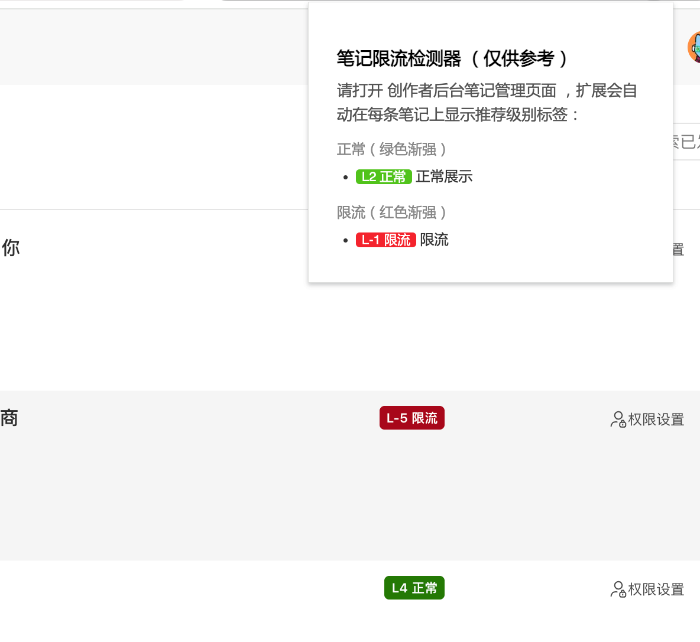

# 📒 限流检测器

## 安装

进入 [releases](https://github.com/Ceelog/note-limited-finder/releases) 下载插件 zip 安装包，在本机解压缩

进入 Chrome 浏览器插件管理页面：`chrome://extensions/`

开启 `Developer mode`, 然后加载解压目录

## 功能

进入管理后台-笔记管理页面，会在每条笔记标题后显示限流级别



## 开发

基于 Plasmo 浏览器插件开发框架，支持 typescript

```
pnpm install
pnpm dev
```

将在 build/chrome-mv3-dev 完成打包
